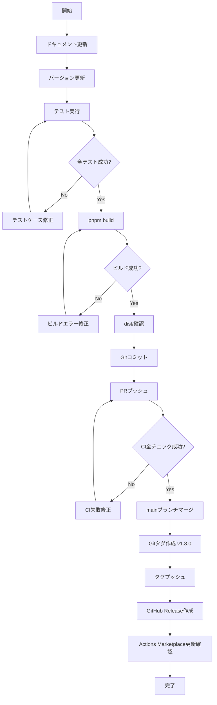

# 技術設計書: PR Insights Labelerへの改名

## Overview

本機能は、現在の「PR Labeler」プロダクト名を「PR Insights Labeler」に統一的に改名し、適切なバージョンインクリメントを実施します。この改名により、プロダクトの価値提案である「PRに対する包括的な分析と洞察（insights）の提供」をより明確に表現します。

**目的**: プロダクト名の統一的更新により、ブランド価値を明確化し、ユーザーに対して提供する機能の本質（分析と洞察）を正確に伝える

**対象ユーザー**: 全ユーザー（既存ユーザーへの影響最小化、新規ユーザーへの明確な価値提案）

**影響範囲**: プロダクト名を参照する全ドキュメント、設定ファイル、コード内コメント、ステアリングドキュメント、バージョン管理

### Goals

- プロダクト名「PR Insights Labeler」への完全な統一
- セマンティックバージョニングに従ったマイナーバージョンのインクリメント（1.7.1 → 1.8.0）
- GitHub Actions Marketplaceでの新プロダクト名の公開
- 既存機能の完全な後方互換性維持
- 全ドキュメント・設定ファイル・コードコメントの整合性確保

### Non-Goals

- 機能の追加・変更・削除は行わない
- 既存のGitHub Actions入力パラメータの変更は行わない
- 既存のラベル命名規則の変更は行わない
- 既存の設定ファイル形式の変更は行わない
- アーキテクチャの変更は行わない

## Architecture

### Existing Architecture Analysis

本機能は既存システムの変更を伴わない、プロダクト名の単純な置換作業です。以下の既存パターンを維持します：

- **モジュール構成**: src/配下のファイル構成、命名規則は変更なし
- **型定義**: TypeScript型定義、インターフェース名は変更なし
- **API契約**: GitHub Actions入力・出力インターフェースは変更なし
- **データフロー**: 入力→分析→ラベリング→出力のパイプラインは変更なし
- **エラーハンドリング**: neverthrowベースのResult<T, E>パターンは変更なし

### 技術整合性

**既存技術スタックとの整合**:

本改名作業は既存技術スタックに対する変更を含みません。以下の技術要素は全て維持されます：

- **Runtime**: Node.js 20+、GitHub Actions環境
- **言語**: TypeScript 5.9.3（strict mode）
- **ビルドツール**: @vercel/ncc（バンドル戦略）
- **パッケージマネージャー**: pnpm 10.20.0
- **テストフレームワーク**: Vitest 4.0.5
- **コード品質**: ESLint 9.38.0 (Flat Config)、Prettier 3.6.2
- **エラーハンドリング**: neverthrow 8.2.0

**新規依存関係**: なし

**変更ファイル種別**:

- ドキュメントファイル（Markdown）: README.md、README.ja.md、CHANGELOG.md、docs/配下全ファイル
- 設定ファイル（YAML/JSON）: action.yml、package.json、src/locales/**/*.json
- ワークフローファイル（YAML）: .github/workflows/*.yml（job名、ステップ名）
- ステアリングドキュメント（Markdown）: .kiro/steering/product.md、structure.md、tech.md
- コードコメント（TypeScript）: ソースコード内のプロダクト名参照コメント
- i18nメッセージ（JSON）: src/locales/en/*.json、src/locales/ja/*.json（ランタイム出力の完全統一）

## System Flows

本機能はシステムフローに影響を与えません。既存のデータフロー、ワークフロー、API呼び出しシーケンスは全て維持されます。

## Requirements Traceability

| Requirement | 要件概要 | 対象ファイル | 実現方法 |
| ------------- | --------- | ------------- | --------- |
| 1 | プロダクト名の統一的更新 | action.yml, package.json, README.md, README.ja.md, CHANGELOG.md, .kiro/steering/*.md, docs/*, src/*, src/locales/**/*.json, .github/workflows/*.yml | テキスト置換：「PR Labeler」→「PR Insights Labeler」（i18nメッセージ、ワークフローjob名を含む完全統一） |
| 2 | バージョン管理とリリース準備 | package.json, CHANGELOG.md, dist/ | バージョン更新（1.7.1→1.8.0）、CHANGELOG追記、pnpm buildでdist/再生成 |
| 3 | GitHub Actions Marketplace更新 | action.yml | name・descriptionフィールド更新、branding維持 |
| 4 | ドキュメント整合性確保 | README.md, README.ja.md, docs/* | 全Markdownファイル内のプロダクト名参照を統一 |
| 5 | 後方互換性維持 | action.yml, src/* | 入力パラメータ、ラベル命名規則、設定ファイル形式を変更しない |
| 6 | テストとビルド検証 | **tests**/*, dist/ | pnpm lint/type-check/test/build実行、テストケース内の名前参照更新 |
| 7 | Kiroステアリング更新 | .kiro/steering/product.md, structure.md, tech.md | プロダクト名参照更新、updated_atタイムスタンプ更新 |
| 8 | リリースノート作成 | CHANGELOG.md | 新バージョンエントリー追加、改名詳細と後方互換性維持を明記 |

## Components and Interfaces

### ドキュメント更新モジュール

#### 責任と境界

**主要責任**: プロダクト名を参照する全ドキュメントファイルのテキスト置換

**ドメイン境界**: ドキュメント層（Markdown、YAML、JSON、TypeScriptコメント）

**データ所有**: ファイルシステム上のテキストファイル

**トランザクション境界**: ファイル単位（各ファイルの読み書きは独立）

#### 依存関係

**Inbound**: なし（手動実行またはCI/CD自動実行）

**Outbound**: ファイルシステムI/O

**External**: なし

#### 契約定義

**Service Interface**:

本機能は実装コードではなく、手動または自動化されたテキスト置換プロセスとして実行されます。型定義やサービスインターフェースは不要です。

**前提条件**:

- 対象ファイルが存在し、読み書き可能である
- 置換パターン「PR Labeler」が明確に定義されている
- バックアップまたはバージョン管理（Git）が有効である

**事後条件**:

- 全ドキュメントで「PR Labeler」が「PR Insights Labeler」に置換されている
- package.jsonのversionフィールドが1.8.0に更新されている
- CHANGELOG.mdに新バージョンエントリーが追加されている
- pnpm buildが成功し、dist/index.jsが再生成されている

**不変条件**:

- ファイルのフォーマット（Markdown、YAML、JSON）は維持される
- 既存の機能コード（TypeScript実装）は変更されない
- action.ymlの入力・出力インターフェースは変更されない

### バージョン管理モジュール

#### 責任と境界

**主要責任**: セマンティックバージョニングに従ったバージョンインクリメントとCHANGELOG更新

**ドメイン境界**: バージョン管理層（package.json、CHANGELOG.md）

**データ所有**: バージョン番号、変更履歴

**トランザクション境界**: バージョン更新とCHANGELOG更新は一体として実行

#### 依存関係

**Inbound**: ドキュメント更新モジュール（先行実行）

**Outbound**: ビルドシステム（pnpm build）

**External**: npm（セマンティックバージョニング規約）

#### 契約定義

**Service Interface**:

手動実行プロセス：

```bash
# 1. package.jsonのversionフィールドを手動で1.8.0に更新
# 2. CHANGELOG.mdに新バージョンエントリーを追記
# 3. pnpm buildを実行してdist/を再生成
```

**前提条件**:

- 現在のバージョンが1.7.1である
- ドキュメント更新が完了している
- 全テストが成功している（pnpm test）

**事後条件**:

- package.jsonのversionが「1.8.0」である
- CHANGELOG.mdに「## [1.8.0] - YYYY-MM-DD」エントリーが存在する
- dist/index.jsが最新のコードでビルドされている

### ステアリングドキュメント更新モジュール

#### 責任と境界

**主要責任**: .kiro/steering/配下のプロダクト名参照とタイムスタンプの更新

**ドメイン境界**: Kiro仕様管理層

**データ所有**: プロジェクトメモリ（steering documents）

**トランザクション境界**: 各ステアリングファイル独立

#### 依存関係

**Inbound**: なし

**Outbound**: ファイルシステムI/O

**External**: Kiro Spec-Driven Development規約

#### 契約定義

**前提条件**:

- .kiro/steering/product.md、structure.md、tech.mdが存在する
- 各ファイルにupdated_atフィールドが存在する

**事後条件**:

- product.md内の「Product Description」セクションで「PR Labeler」が「PR Insights Labeler」に置換されている
- structure.md内の全プロダクト名参照が「PR Insights Labeler」に置換されている（ルート名`pr-labeler/`は実リポジトリ名維持）
- tech.md内の全プロダクト名参照が「PR Insights Labeler」に置換されている
- 各ファイルのupdated_atが実装時の実際の日時（ISO 8601形式）に更新されている

### ビルドシステム統合

#### 責任と境界

**主要責任**: 更新されたソースコードから配布可能なバンドルファイルを生成

**ドメイン境界**: ビルドパイプライン層

**データ所有**: dist/index.js、dist/index.js.map

**トランザクション境界**: ビルドプロセス全体（ncc compile → dist/生成）

#### 依存関係

**Inbound**: バージョン管理モジュール、ドキュメント更新モジュール

**Outbound**: GitHub Actions実行環境（dist/index.jsを参照）

**External**: @vercel/ncc（バンドラー）

#### 契約定義

**Service Interface**:

```bash
pnpm build
```

**前提条件**:

- package.jsonが有効である
- src/配下の全TypeScriptファイルが型チェックを通過している
- node_modules/が最新の依存関係で更新されている

**事後条件**:

- dist/index.jsが生成されている
- dist/index.js.mapが生成されている
- dist/licenses.txtが生成されている
- pnpm lintが成功する
- pnpm type-checkが成功する
- pnpm testが成功する

## Data Models

本機能はデータモデルの変更を含みません。既存のTypeScript型定義、インターフェース、データ構造は全て維持されます。

## Error Handling

### Error Strategy

本改名作業は実装コードの変更を含まないため、ランタイムエラーハンドリングは不要です。以下のビルド時・テスト時エラーのみ考慮します：

**ビルドエラー**:

- pnpm build失敗 → nccバンドルエラーまたはTypeScript型エラー
- 対応: pnpm type-checkで事前検証、エラーログ確認

**テストエラー**:

- pnpm test失敗 → 既存テストケースの破損または名前参照の不整合
- 対応: テストケース内のプロダクト名参照を「PR Insights Labeler」に更新

**ドキュメント整合性エラー**:

- 置換漏れによるプロダクト名の不整合
- 対応: grep/ripgrepによる全文検索で「PR Labeler」の残存確認

### Error Categories and Responses

**User Errors (4xx)**: 適用不可（本機能はユーザー入力を受け取らない）

**System Errors (5xx)**:

- ファイルシステムI/Oエラー → 手動実行時のファイルアクセス権限確認
- ビルドエラー → pnpm clean && pnpm buildで再試行

**Business Logic Errors (422)**: 適用不可（ビジネスロジックの変更なし）

### Monitoring

**ログ記録**: なし（ビルド時のstdout/stderrのみ）

**ヘルスチェック**: GitHub Actions CIワークフローの成功確認

- CI: Code Quality（lint + type-check）
- CI: Integration Tests（Node 20, 22）
- CI: PR Metrics Self-Check

## Testing Strategy

### Unit Tests

本機能は実装コードの変更を含まないため、新規ユニットテストは不要です。既存の全ユニットテストが成功することを確認します。

**既存テストの更新**:

以下のテストファイルでプロダクト名を参照している場合、テストケース内の文字列を更新します：

- `__tests__/comment-manager.test.ts`: コメント生成時のプロダクト名参照
- `__tests__/report-formatter.test.ts`: レポートフォーマット時のプロダクト名参照
- `__tests__/__snapshots__/*.snap`: スナップショットテスト内のプロダクト名

### Integration Tests

**既存統合テストの回帰確認**:

- `__tests__/integration.test.ts`: エンドツーエンドのワークフロー実行
- `__tests__/index.test.ts`: メインエントリーポイントの統合動作

**CI/CD統合テスト**:

- `.github/workflows/test-pr-labeler.yml`: 自己適用ワークフローの成功確認
- `.github/workflows/quality.yml`: 品質ゲートの通過確認

### ビルド検証

**必須チェック**:

1. `pnpm lint` → 成功
2. `pnpm type-check` → 成功
3. `pnpm test:vitest` → 全テスト成功
4. `pnpm build` → dist/index.js生成成功

### ドキュメント整合性テスト

**手動検証**:

```bash
# 「PR Labeler」の残存確認（置換漏れチェック）
grep -r "PR Labeler" --exclude-dir=node_modules --exclude-dir=dist --exclude-dir=.git .

# 期待結果: .kiro/specs/rename-to-pr-insights-labeler/配下のみヒット（本仕様書内の参照）
```

## Migration Strategy

本機能はプロダクト名の改名のみを実施し、機能変更を含まないため、ユーザー側の移行作業は不要です。

### Migration Process



### Phase Breakdown

**Phase 1: ドキュメント更新**

- 対象: action.yml、package.json、README.md、README.ja.md、docs/*、.kiro/steering/*
- 作業: テキストエディタまたはスクリプトで「PR Labeler」→「PR Insights Labeler」置換
- 検証: grep -r "PR Labeler"で残存確認

**Phase 2: バージョン更新**

- 対象: package.json、CHANGELOG.md
- 作業:
  - package.json: version: "1.8.0"
  - CHANGELOG.md: 新バージョンエントリー追加
- 検証: package.jsonのバージョンが1.8.0であること

**Phase 3: テスト実行**

- コマンド: pnpm lint && pnpm type-check && pnpm test:vitest
- 検証: 全チェックが成功すること
- 失敗時: テストケース内のプロダクト名参照を更新

**Phase 4: ビルド実行**

- コマンド: pnpm build
- 検証: dist/index.js、dist/index.js.map、dist/licenses.txt生成
- 失敗時: エラーログ確認、pnpm cleanして再試行

**Phase 5: Git操作**

- コミット: git add . && git commit -m "chore: rename to PR Insights Labeler"
- プッシュ: git push origin [feature-branch]
- PR作成: GitHub UIまたはgh prコマンド

**Phase 6: CI検証**

- 対象ワークフロー:
  - Code Quality
  - Integration Tests (Node 20, 22)
  - PR Metrics Self-Check
- 検証: 全ワークフローが成功すること

**Phase 7: マージとリリース**

- mainブランチへマージ
- Gitタグ作成: git tag -a v1.8.0 -m "v1.8.0"
- タグプッシュ: git push origin v1.8.0 && git push origin v1 --force
- GitHub Release作成: CHANGELOG.mdから転記

### Rollback Triggers

**ロールバック条件**:

- CI/CDワークフローの失敗
- 既存機能の破壊（テスト失敗）
- ビルドエラー

**ロールバック手順**:

1. フィーチャーブランチをクローズ
2. mainブランチの最新状態を維持
3. 修正後に再度PRを作成

### Validation Checkpoints

**Checkpoint 1 (Phase 3完了時)**: 全テストが成功していること

**Checkpoint 2 (Phase 4完了時)**: dist/index.jsが生成され、pnpm buildがエラーなく完了すること

**Checkpoint 3 (Phase 6完了時)**: GitHub Actions CIの全ワークフローが成功していること

**Checkpoint 4 (Phase 7完了時)**: GitHub Actions Marketplaceで新プロダクト名「PR Insights Labeler」が表示されていること

## 後方互換性の保証

本改名作業は、以下の既存インターフェースを一切変更しません：

### GitHub Actions入力パラメータ

action.ymlのinputsセクションは変更なし：

- file_size_limit
- file_lines_limit
- pr_additions_limit
- pr_files_limit
- size_enabled、complexity_enabled、category_enabled、risk_enabled
- size_thresholds、complexity_thresholds
- その他全入力パラメータ

### ラベル命名規則

既存のラベルプレフィックスと命名規則は変更なし：

- size/*（size/small、size/medium、size/large、size/xlarge、size/xxlarge）
- complexity/*（complexity/medium、complexity/high）
- category/*（category/tests、category/ci-cd、category/documentation等）
- risk/*（risk/high、risk/medium）
- auto/*（auto/large-files、auto/too-many-files等）

### 設定ファイル形式

既存の設定ファイルフォーマットは変更なし：

- .github/pr-labeler.yml
- .github/directory-labeler.yml

### 出力インターフェース

action.ymlのoutputsセクションは変更なし：

- large_files
- pr_additions
- pr_files
- exceeds_file_size
- その他全出力パラメータ

### コメント・サマリー機能

PRコメント投稿、GitHub Actions Summary出力の機能は変更なし。多言語対応（en/ja）も維持。

## 実装上の注意事項

### ドキュメント更新時の注意

**置換対象文字列**: 「PR Labeler」（スペース区切り、大文字小文字厳密）

**置換後文字列**: 「PR Insights Labeler」

**除外対象**:

- .kiro/specs/rename-to-pr-insights-labeler/配下のファイル（本仕様書は改名前の名前を記録として保持）
- CHANGELOG.mdの過去バージョンエントリー（履歴改ざん防止）

**特殊ケース**:

- package.jsonのnameフィールド: 「pr-labeler」→「pr-insights-labeler」（ケバブケース）
- READMEのタイトル: `# PR Labeler` → `# PR Insights Labeler`
- action.ymlのnameフィールド: `"PR Labeler"` → `"PR Insights Labeler"`

**i18nメッセージの完全統一** ⚠️ 重要:

- `src/locales/en/common.json`: フッター "Generated by [PR Labeler]..." → "Generated by [PR Insights Labeler]..."
- `src/locales/en/logs.json`: 全ログメッセージ（starting, loading, applying, success等）
- `src/locales/ja/common.json`: フッター "PR Labelerにより生成" → "PR Insights Labelerにより生成"
- `src/locales/ja/logs.json`: 全ログメッセージ（開始、読み込み、適用、成功等）
- 目的: ユーザー向け出力の一貫したブランド体験提供

**ワークフローファイルの更新**:

- `.github/workflows/quality.yml`: job name "PR Labeler Self-Check" → "PR Insights Labeler Self-Check"

### バージョン更新時の注意

**セマンティックバージョニング**:

- MAJOR（破壊的変更）: 該当しない
- MINOR（後方互換性のある新機能）: 改名はブランディング変更として扱う → 1.7.1から1.8.0へ
- PATCH（バグフィックス）: 該当しない

**CHANGELOG.md形式** (Keep a Changelog):

```markdown
## [1.8.0] - YYYY-MM-DD (実装時の実際の日付を使用)

### Changed

- プロダクト名を「PR Insights Labeler」に改名
- 既存機能への影響なし（後方互換性維持）
```

**Gitコミットメッセージ形式** (Conventional Commits):

```
chore: rename product to PR Insights Labeler

Co-Authored-By: Claude <noreply@anthropic.com>
```

### ステアリングドキュメント更新時の注意

**updated_atフィールド**: 実装時の実際の日時をISO 8601形式で記録（例: 2025-01-15T10:30:00Z）

**product.md更新箇所**:

- タイトル: `# Product Overview - PR Insights Labeler`
- updated_at: 実装時の実際の日時（ISO 8601形式、例: `2025-01-15T10:30:00Z`）
- Product Description段落: 冒頭文を「PR Insights Labeler（旧: PR Labeler）...」に更新

**structure.md更新箇所**:

- タイトル: `# Project Structure - PR Insights Labeler`
- updated_at: 実装時の実際の日時（ISO 8601形式、例: `2025-01-15T10:30:00Z`）
- ディレクトリツリー内のコメント: プロダクト名"PR Labeler"を"PR Insights Labeler"に更新（ルート名`pr-labeler/`は実リポジトリ名と一致させるため変更しない）

**tech.md更新箇所**:

- タイトル: `# Technology Stack - PR Insights Labeler`
- updated_at: 実装時の実際の日時（ISO 8601形式、例: `2025-01-15T10:30:00Z`）
- アーキテクチャセクションのコメント: プロダクト名参照を更新

### テストケース更新時の注意

**スナップショットテスト**:

- `__tests__/__snapshots__/comment-manager.test.ts.snap`: プロダクト名を含むスナップショットを更新
- `__tests__/__snapshots__/report-formatter.test.ts.snap`: レポートフォーマット結果のスナップショットを更新

**更新手順**:

1. テストケース内のプロダクト名参照を「PR Insights Labeler」に更新
2. pnpm test:vitest --update（スナップショット更新）
3. 変更差分を確認し、意図した更新のみが含まれていることを検証

### CI/CD実行時の注意

**CIワークフロー**:

- `.github/workflows/test-pr-labeler.yml`: ワークフロー名はそのまま維持（履歴継続のため、ファイル名は変更しない）
- `.github/workflows/quality.yml`: job name "PR Labeler Self-Check" → "PR Insights Labeler Self-Check" に更新（要件1 AC12に従う）

**Self-Check動作**:

- PR Metrics Self-Checkワークフローは、改名後のアクションを自己適用するため、動作確認に有効

### GitHub Marketplace更新の注意

**自動更新**:

- Gitタグ（v1.8.0）をプッシュすると、GitHub Actions Marketplaceは自動的にaction.ymlから新プロダクト名を取得して表示を更新
- 手動操作は不要

**確認項目**:

- Marketplace上でプロダクト名が「PR Insights Labeler」と表示されていること
- descriptionが更新されていること
- brandingセクション（icon: file-text、color: purple）が維持されていること
